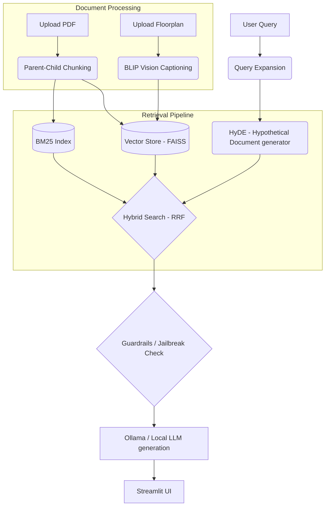

# RealEstateRAG: AI-Powered Real Estate Due Diligence Assistant

A college-level Advanced RAG Multimodal Chatbot project demonstrating state-of-the-art information retrieval, vision processing, and LLM-as-a-judge evaluation for real estate properties.

## Architecture & Advanced RAG Pipeline



## Setup Instructions

1. **Clone & Virtual Environment**
```bash
git clone <repo-url>
cd RealEstateRAG
python -m venv venv
# Windows: venv\\Scripts\\activate
# Mac/Linux: source venv/bin/activate
```

2. **Install Dependencies**
```bash
pip install -r requirements.txt
```

3. **Environment Variables**
Create a `.env` file in the root directory:
```
GROQ_API_KEY=your_groq_api_key
OLLAMA_BASE_URL=http://localhost:11434
```

4. **Start Ollama Locally**
Make sure you have Ollama installed and running. Pull your preferred model:
```bash
ollama pull mistral
# or ollama pull llama3
```

5. **Run the Application**

Terminal 1 (Backend - FastAPI):
```bash
cd backend
uvicorn main:app --reload
```

Terminal 2 (Frontend - Streamlit):
```bash
cd frontend
streamlit run streamlit_app.py
```

## Module Overview

- **`backend/retrieval/bm25.py`**: Sparse keyword-based retrieval. Fast and robust for exact terminology (e.g., "3BHK", specific addresses).
- **`backend/retrieval/dense.py`**: Semantic search using `sentence-transformers/all-MiniLM-L6-v2` and FAISS. Understands context.
- **`backend/retrieval/hybrid_rrf.py`**: Merges Sparse and Dense lists using Reciprocal Rank Fusion.
- **`backend/retrieval/parent_child_chunking.py`**: Retrieves smaller specific sentences (children) but provides the entire surrounding paragraph/page (parent) to the LLM.
- **`backend/rag/baseline_rag.py`**: Naive approach to show the "Broken Baseline".
- **`backend/rag/query_expansion.py` & `hyde.py`**: Enriches queries and creates hypothetical embeddings to capture deeper semantic neighbors.
- **`backend/vision/floorplan_analyzer.py`**: Uses BLIP to caption floorplans and integrates them into the searchable vector space.
- **`backend/evaluation/`**: Contains the `golden_dataset.json` and `llm_judge.py` which uses the Groq API to evaluate answers objectively.

## Solving Real Estate Problems
1. **Property comparison & intelligent search**: Resolved via Hybrid Retrieval ensuring both specifications and descriptions are matched.
2. **Floor plan understanding**: BLIP vision model captions images and adds to vector context.
3. **Legal document summarization & risk flagging**: Chunking explicitly handles long legal PDFs without losing context. Guardrails prevent non-real-estate advice.
4. **Builder reputation & investment risks**: Handled via comprehensive prompt engineering and querying external context provided in PDFs.
